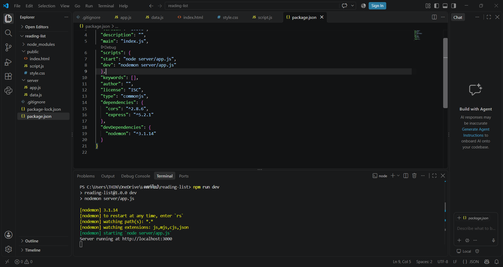
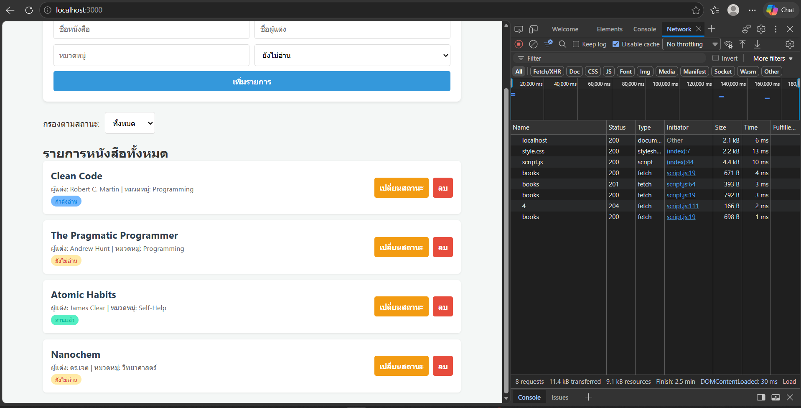
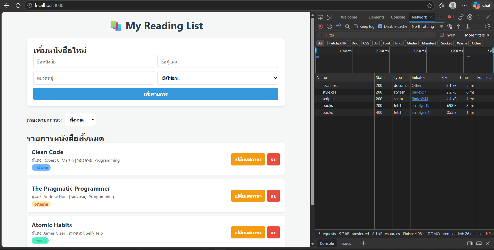

# 📚 My Reading List Web Application

แอปพลิเคชันจัดการรายการหนังสือที่อยากอ่าน พัฒนาด้วย Full-Stack REST API (Node.js/Express) เชื่อมต่อกับหน้าเว็บฝั่งไคลเอนต์ (HTML, CSS, JavaScript)

โครงสร้าง

reading-list-app/
├── package.json
├── .gitignore          <-- สร้างใหม่
├── server/             <-- โฟลเดอร์ใหม่
│   ├── app.js          <-- สร้างใหม่
│   └── data.js         <-- สร้างใหม่
└── public/             <-- โฟลเดอร์ใหม่
    ├── index.html      <-- สร้างใหม่
    ├── style.css       <-- สร้างใหม่
    └── script.js       <-- สร้างใหม่
---

## 🚀 วิธีการติดตั้งและการรันโปรเจกต์ (Installation & Running)

1. **ติดตั้ง Dependencies ทั้งหมด:**
   ```bash
   npm install

เริ่มทำงานเซิร์ฟเวอร์ (Development Mode):
Bash
npm run dev

เข้าใช้งานผ่านเบราว์เซอร์:
เปิดลิงก์ http://localhost:3000

Method,Endpoint,Description,Query / Body Parameter,Status Code
GET,/api/books,ดึงรายการหนังสือทั้งหมด,?category=... หรือ ?status=...,200 
GET,/api/books/:id,ดึงรายการหนังสือตาม ID,Route Parameter (:id),"200 , 404 
POST,/api/books,เพิ่มหนังสือเล่มใหม่,"JSON Body (title, author, category, status)","201 , 400 
PATCH,/api/books/:id,แก้ไขข้อมูล/สถานะหนังสือ,Route Parameter (:id) + JSON Body,"200 , 404 
DELETE,/api/books/:id,ลบรายการหนังสือ,Route Parameter (:id),"204 No Content, 404 

## 🔍 หลักฐานการดีบักและการทดสอบ (Debugging Proofs)

### 1. ฝั่ง Backend Server (Node.js Console Log)
แสดงการรันเซิร์ฟเวอร์สำเร็จบนพอร์ต 3000 ด้วย `nodemon`:



### 2. ฝั่ง Client Browser (DevTools Network Tab)
แสดงการยิง REST API ผ่าน `fetch()` ได้รับ HTTP Status `200 OK`, `201 Created` และ `204 No Content` เรียบร้อย:



### 3. การทดสอบ Error Handling (Status 400 Bad Request)
แสดงการตอบกลับ Status 400 เมื่อผู้ใช้ส่งข้อมูลฟอร์มไม่ครบถ้วน:

